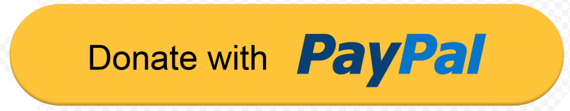
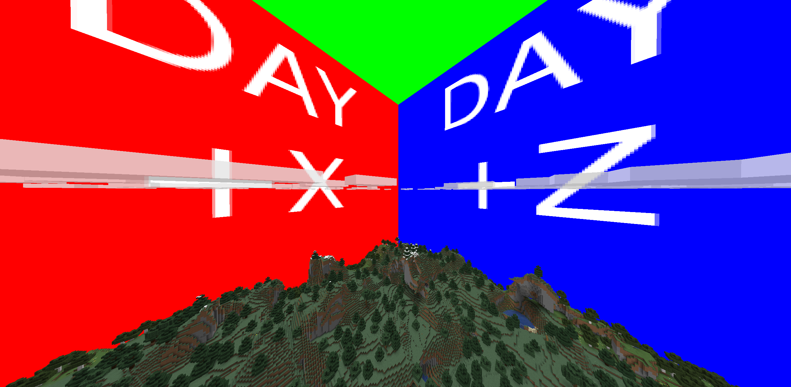
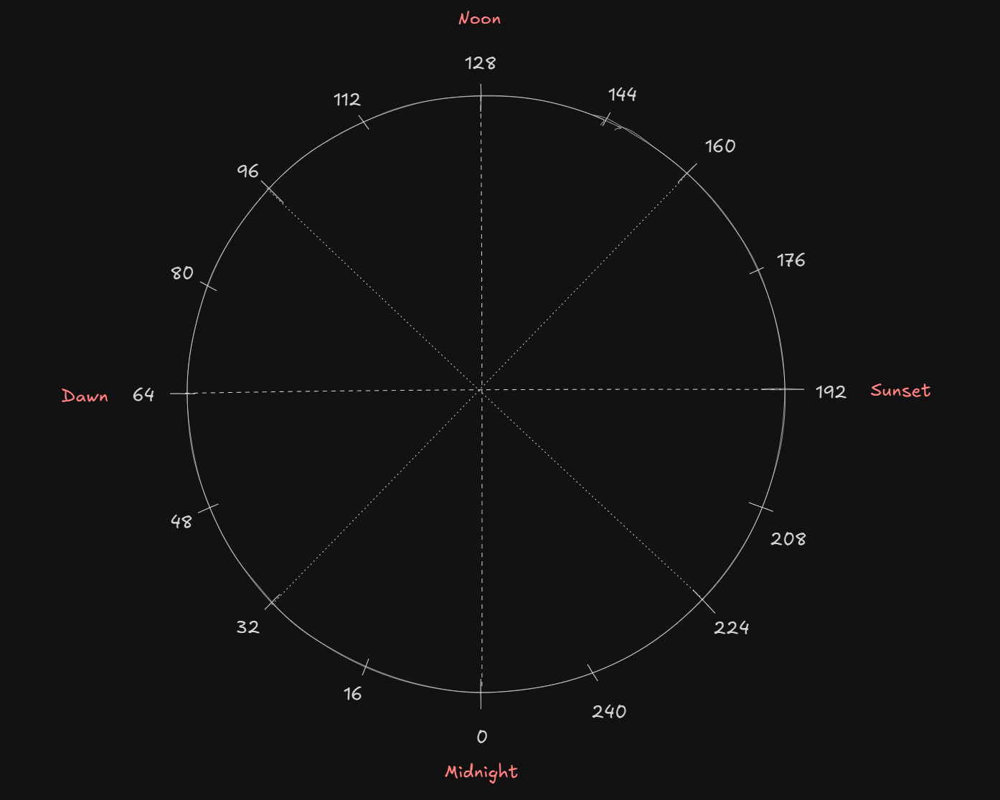

# Minecraft vanilla skybox template pack

Only supports 1.21.5 and up (plus 25w10a and up for snapshots)!

An implementation of skyboxes in vanilla minecraft.

If you found this pack helpful, consider donating:

|                                                             |                                                                                                 |
| ----------------------------------------------------------- | ----------------------------------------------------------------------------------------------- |
|  |  |

You're free to use the pack forever in return of a credit and link to this github repository on the distribution site. If these terms don't work for you, contact me on Discord (@balintcsala) or through GitHub.

## Customization

All customization happens through the sun texture (`assets/minecraft/textures/environment/sun.png`).

Make sure you have a list of skybox textures in the [OptiFine format](https://optifine.readthedocs.io/custom_sky.html?h=skybox). You need to choose two timestamps for each of them: A starting and ending interpolation time. When the current time is between these two values, the respective skybox will slowly replace the previous one in the list (or the last one if it's the first) and will reach full opacity at the ending interpolation time.

The current time is based on the angle of the sun around the Z axis and is between 0 and 255 (inclusive) according the following diagram:

For reference the default sun.png includes two skyboxes, a day skybox that starts at 64 (dawn) and reaches full opacity at 80, and a night skybox that starts at 176 and reaches full opacity at 192.

Order the skyboxes such that the start times are in increasing order. `sun.png` should be created based on the following structure:

- Put the original sun texture in the top left corner, modified to have an alpha value of 17 everywhere.
- Right below the sun is the list of skyboxes in chronological order.
- Before every skybox, place a gap that's 1 pixel tall. The first pixel on the left inside this gap should contain the starting interpolation time of the skybox in the red channel and similarly the second pixel should contain the ending interpolation time.
- Place the skybox after the gap.

## Other customizations

### Solid moon

Some packs require the moon to be solid instead of behaving additively. For this you'll have to provide an alpha mask for the moon:

1. Take one sprite/frame from your moon_phases texture (`assets/minecraft/textures/environment/moon_phases.png`) and scale it up or down to the height of your original `sun.png` texture (before you added the skyboxes).
2. If the background of the texture isn't transparent, remove it from the image (with Photoshop or Gimp). Make sure only the solid parts are kept, stuff like the glow from the moon shouldn't be.
3. Place the edited image right next to the original sun texture in the edited `sun.png`.

The example `sun.png` texture includes this feature if you need some reference.

The solution doesn't support changing moon shapes and might be at a lower resolution, than the original texture (though you can counteract this by making the sun texture larger).

### Return fog

The shader removes fog by default, because it might clash with the skybox. To revert this, delete `assets/minecraft/shaders/include/fog.glsl`.

### Return the horizon

The shader removes the horizon of the game (only appears at sunset and gives the lower edge of the sky an orangeish hue). If you want to revert this, delete `assets/minecraft/shaders/core/position_color.vsh` and the same but with `.fsh`.

## Limitations

- Skyboxes can only be based on time for now, not weather or other events.
- Skybox interpolation times can't overlap, the ending interpolation time of a skybox _must_ be less, than the starting interpolation time of the next one in the list.
- The sun texture has to be narrower, than the skyboxes.
- The sun is placed additively on top of the skybox, this means that it will disappear when the background is white.
- Most likely not compatible with graphics mods, e.g. Sodium, IRIS, OptiFine.
- GPUs have differing maximum supported texture sizes. If the sun texture exceeds these in height or width, the shader won't load and the game might crash.
  - Intel igpus: 8192
  - AMD: 16384
  - Nvidia: 32768

## Example configuration

This configuration matches the default one in the pack.

`sun.png`:

- Original sun.png with a modified alpha value of 17 in the top left 32x32 pixels.
- First skybox:
  - Row 33, pixel 0: Red channel is 64
  - Row 33, pixel 1: Red channel is 80
  - Skybox placed between (0, 34) and (768, 546)
- Second skybox:
  - Row 547, pixel 0: Red channel is 176
  - Row 547, pixel 1: Red channel is 192
  - Skybox placed between (0, 548) and (768, 1060)

Example timestamps:

- **Time = 0 to Time = 63**: The night skybox is shown
- **Time = 64**: The day skybox starts taking over
- **Time = 72**: The day skybox is 50% visible
- **Time = 80 to Time = 175**: The day skybox is fully visible
- **Time = 176**: The night skybox starts taking over
- **Time = 184**: The night skybox is 50% visible
- **Time = 192 to Time = 255**: The night skybox is fully visible

## Examples for incorrect configurations

### Skyboxes overlapping

first skybox:

- starting interp time: 128
- ending interp time: 192

second skybox:

- starting interp time: 160
- ending interp time: 250

### Skyboxes are in the wrong order

first skybox:

- starting interp time: 160
- ending interp time: 250

second skybox:

- starting interp time: 128
- ending interp time: 136

### Skybox ending interpolation time is before the starting interpolation time

skybox:

- starting interp time: 250
- ending interp time: 160
